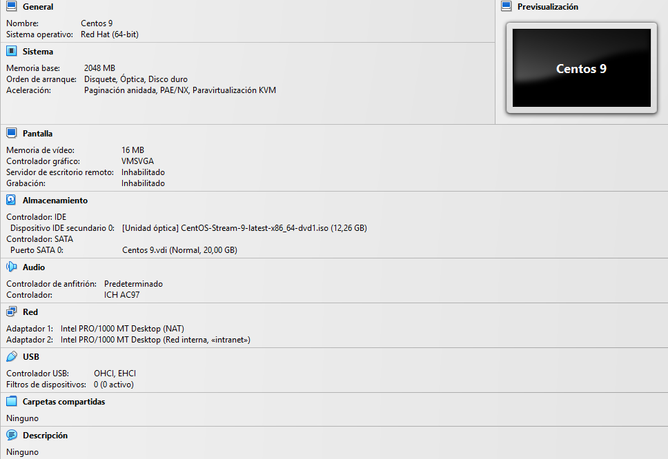
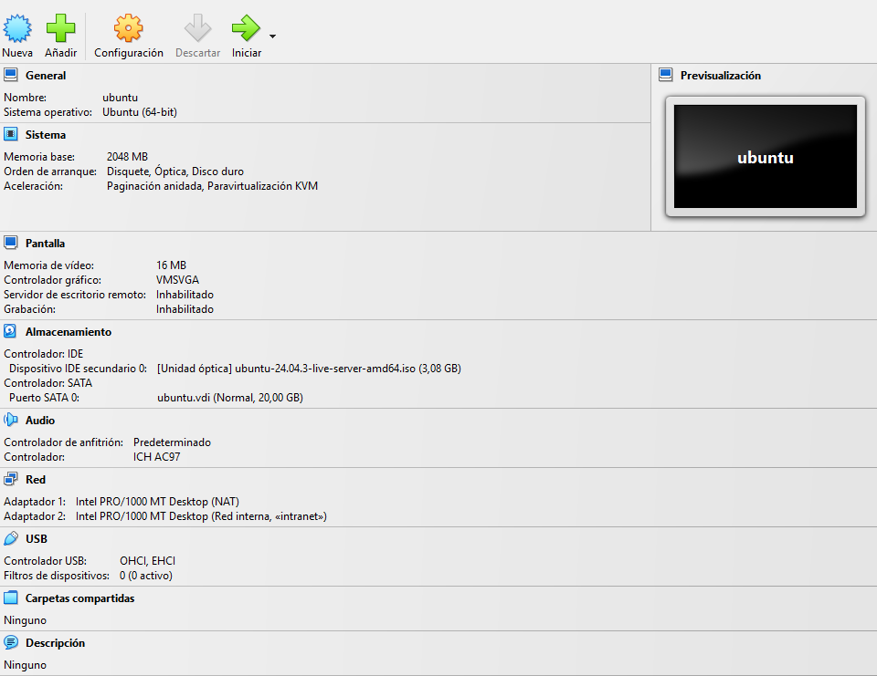
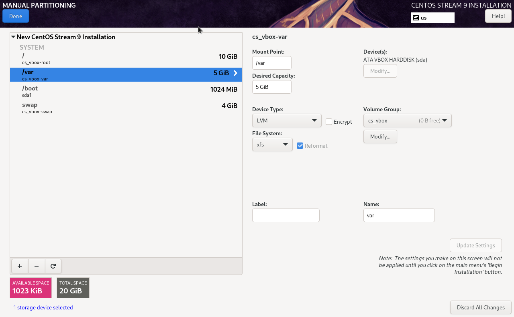
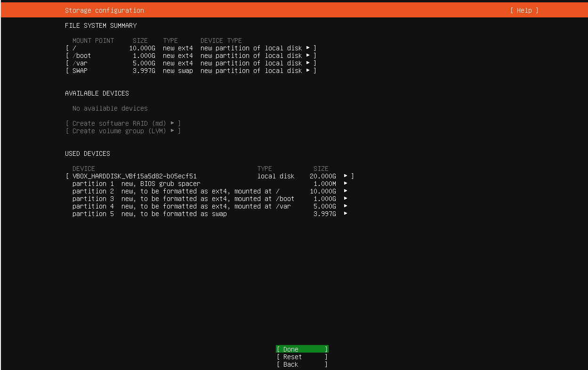
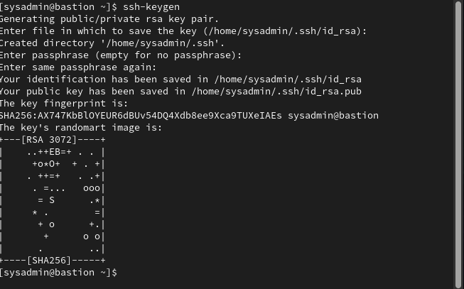
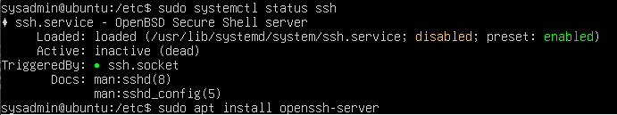

# Procedimiento de Instalación y Configuración de los Servidores

## 1. Instalacion de los servidores

Se instalaron los servidores:

ubuntu - 192.168.10.20
centos9 - 192.168.10.10
bastion - 192.168.10.30

Utilizamos ansible desde el bastion para ejecutar comandos y playbooks, usandolo como nodo de control.

Caracteristicas de Hardware virtual:

centos9:

ubuntu:

## 2. Creación de Particiones

Durante la instalación, crear las siguientes particiones:

Particionado centos9:

Particionado ubuntu:

## 2. Configuración de Interfaces de Red

Se deben crear dos interfaces de red:

- **enp0s3:** red nateada para salida a internet.
- **enp0s8:** Conectada a la red interna de servidores

## 3. Configuración de la clave pública SSH desde el servidor bastión

Desde el servidor bastión, copiar la clave pública a los servidores para permitir el acceso por SSH:

Creacion de llaves ssh:

Copiado de llaves:

El copiado puede dar error al no tener instalado ssh en ubuntu.

Instalacion de SSH en ubuntu:

## 4. Instalacion de Ansible en bastion y colecciones necesarias

---
