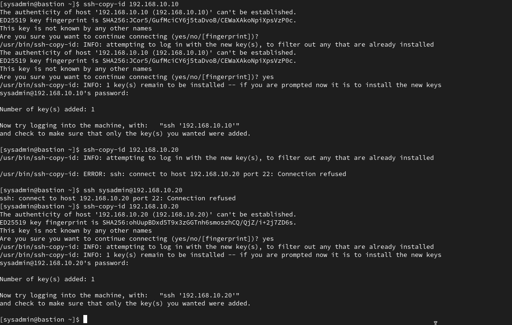

# Procedimiento de Instalación y Configuración de los Servidores

## 1. Instalacion de los servidores

Se instalaron los servidores:

ubuntu - 192.168.10.20
centos9 - 192.168.10.10
bastion - 192.168.10.30

Utilizamos ansible desde el bastion para ejecutar comandos y playbooks, usandolo como nodo de control.

Caracteristicas de Hardware virtual:

centos9:


ubuntu:


## 2. Creación de Particiones

Durante la instalación, crear las siguientes particiones:

Particionado centos9:

Durante la instalación, se seleccionó el particionado manual para crear las particiones requeridas en CentOS 9.


Particionado ubuntu:

De igual forma, en Ubuntu se procedió a crear las particiones necesarias mediante el particionado manual.


## 2. Configuración de Interfaces de Red

Se deben crear dos interfaces de red:

- **enp0s3:** red nateada para salida a internet.
- **enp0s8:** Conectada a la red interna de servidores

La red 192.168.10.0/24 es la red interna que utilizamos para comunicar los hosts.

## 3. Configuración de la clave pública SSH desde el servidor bastión

Desde el servidor bastión, copiar la clave pública a los servidores para permitir el acceso por SSH:

Creación de llaves ssh:

Para generar un par de llaves SSH (pública y privada) en el servidor bastión, se ejecutó el siguiente comando:
```bash
ssh-keygen
```
Este comando crea las llaves necesarias para autenticación sin contraseña entre el bastión y los otros servidores.


Copiado de llaves:

Para copiar la clave pública generada al servidor de destino, se utilizó el comando:
```bash
ssh-copy-id usuario@ip_del_servidor
```
Esto permite que el servidor bastión pueda autenticarse por SSH sin necesidad de ingresar la contraseña cada vez.



Nota: El copiado puede dar error si el servicio SSH no está instalado en el servidor de destino (por ejemplo, en Ubuntu).

Instalación de SSH en ubuntu:

Para instalar el servidor SSH en Ubuntu, se ejecutó el siguiente comando:
```bash
sudo apt install openssh-server
```
Este comando instala y habilita el servicio SSH, permitiendo conexiones remotas.


## 4. Instalacion de Ansible en bastion y colecciones necesarias

Instalamos Ansible en nuestro equipo bastión:

Para instalar Ansible, se ejecutó el siguiente comando:
```bash
sudo dnf install ansible
```
o en sistemas basados en Ubuntu:
```bash
sudo apt install ansible
```
Esto instala la herramienta principal que utilizaremos para automatizar la configuración de los servidores.


Instalamos las colecciones necesarias para nuestros playbooks:

Es necesario instalar las siguientes colecciones de ansible para contar con los módulos requeridos:
- `ansible.posix`
- `community.general`

Para instalar cada colección se utiliza el comando:
```bash
ansible-galaxy collection install ansible.posix
ansible-galaxy collection install community.general
```
Esto asegura que tengamos disponibles los módulos adicionales necesarios para las tareas de automatización.

La siguiente captura muestra como ejemplo la instalación de la colección `ansible.posix` (el procedimiento es el mismo para `community.general`):


## 5. (opcional) Control de versiones con GIT

Si queremos mantener un control de versiones sobre nuestros playbooks debemos contar con GIT.

---
