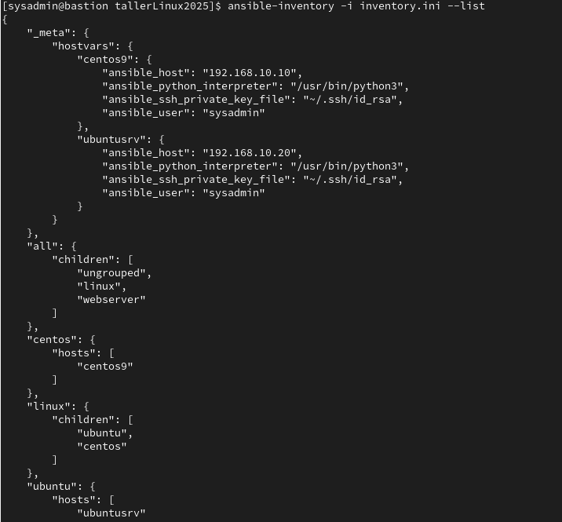

# Prueba de conexión de Ansible

## Listar inventario

Para listar los hosts disponibles en el inventario de Ansible, se utiliza el siguiente comando:

```bash
ansible-inventory -i inventory.ini --list
```



## Hacer ping a todos los hosts

Para verificar la conectividad con todos los hosts del inventario, se puede usar el módulo ping de Ansible:

```bash
ansible all -i inventory.ini -m ping
```


